# CRCS Frontend

Admin Views

 

#### Features:

- [x] Visualize the Society Data with interactive charts
- [x] Filters to filter the data various features
- [x] Use of Chart.js to facilitate the charts like Bar, Pie, Doughnut, Area Graph etc.

#### Screenshots:

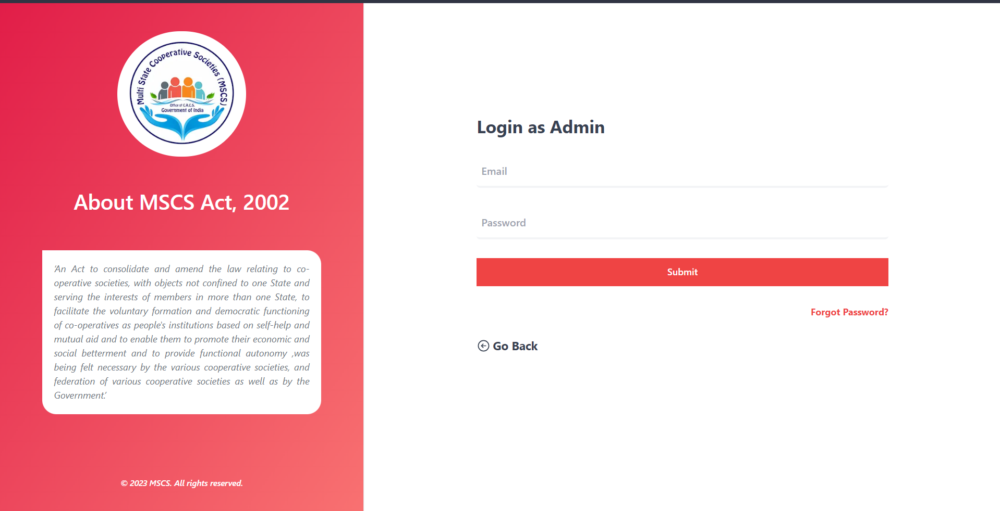

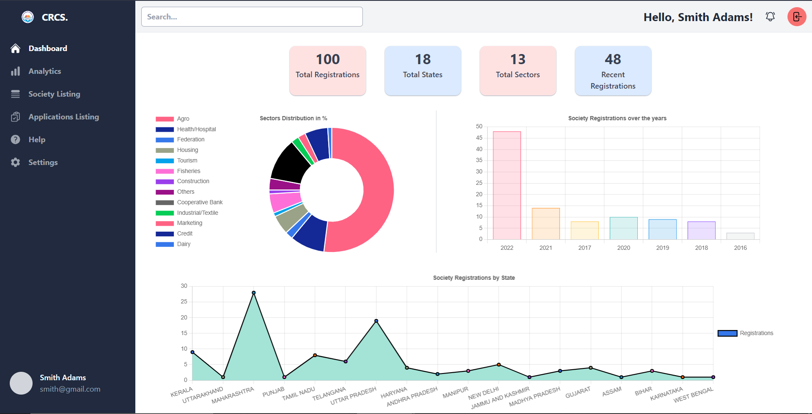

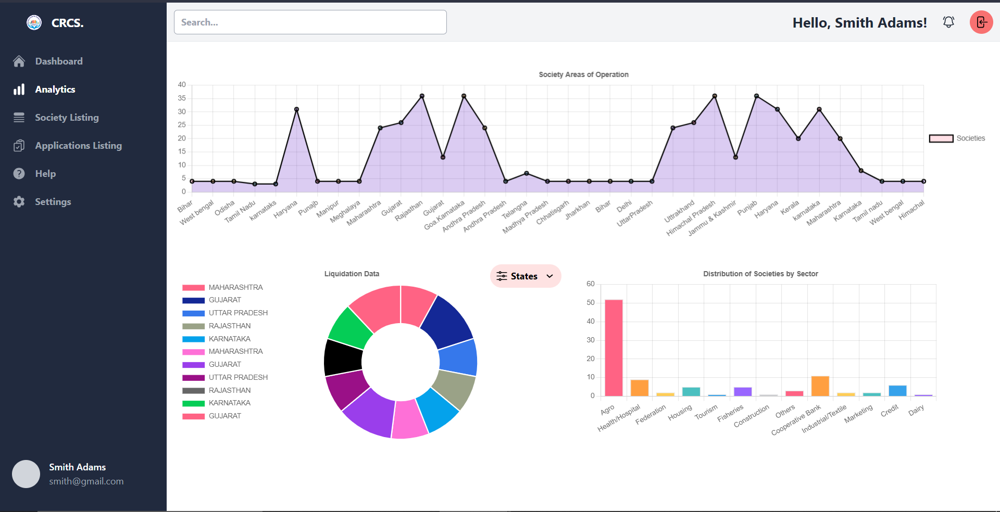

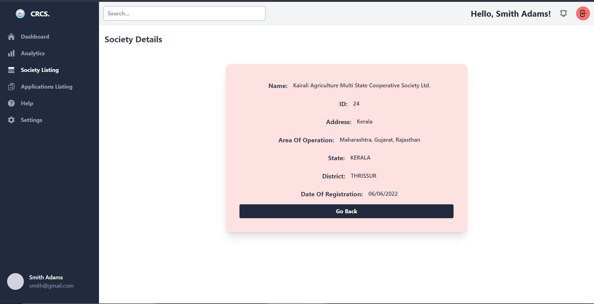

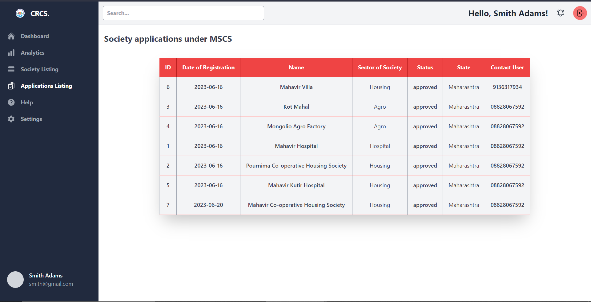

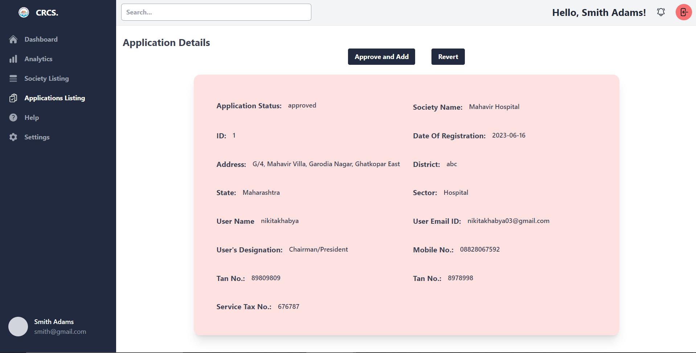

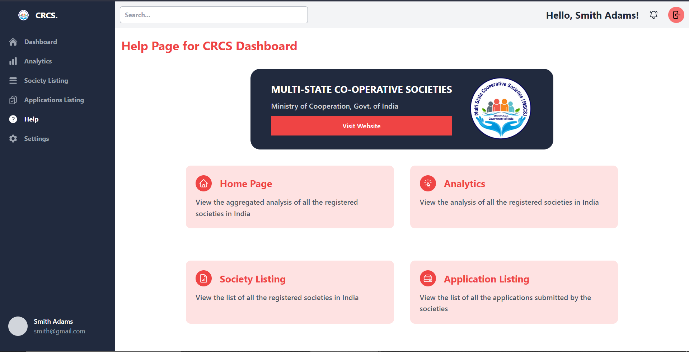

User Views

 

#### Features:

- [x] Society Registration to facilitate an application to register a new society
- [x] Various forms to facilitate the internal working of the society
- [x] Grievances form to facilitate the users to raise their grievances

#### Screenshots:

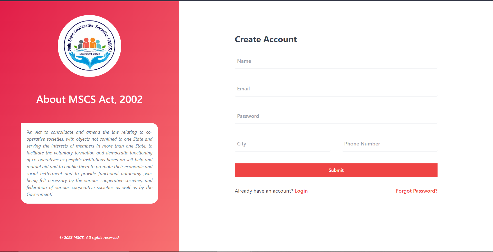

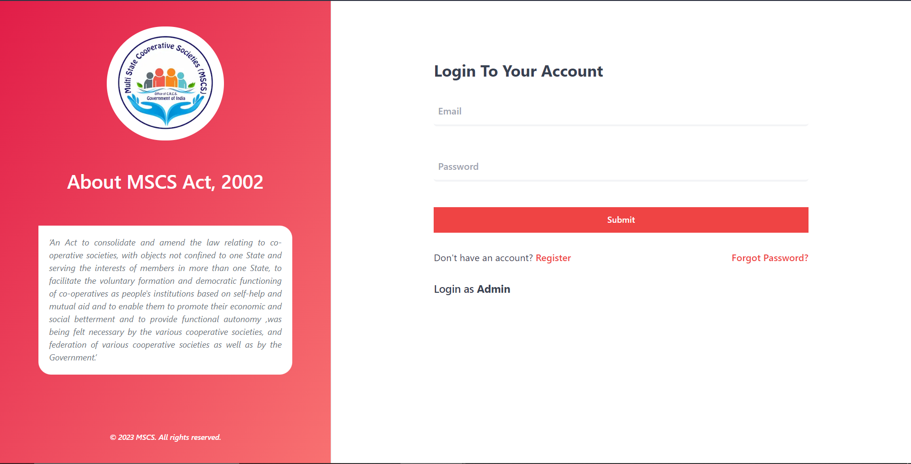

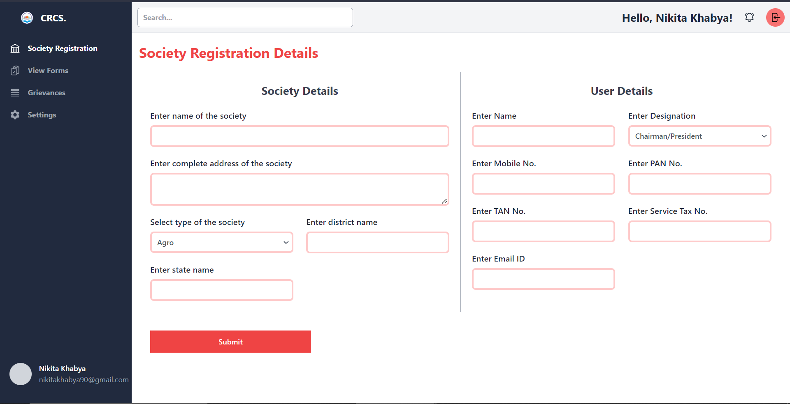

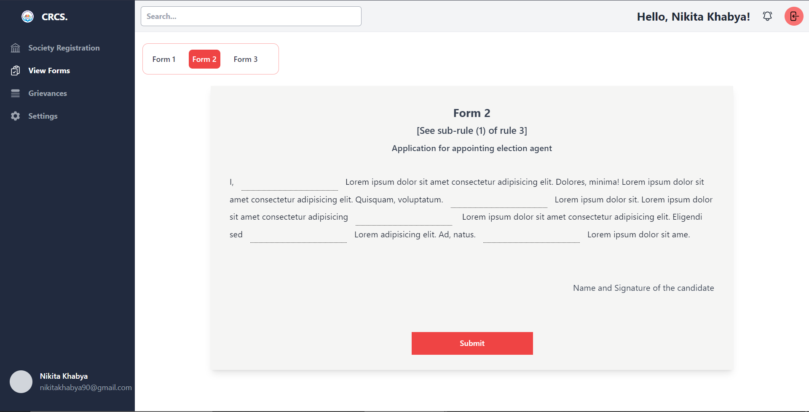

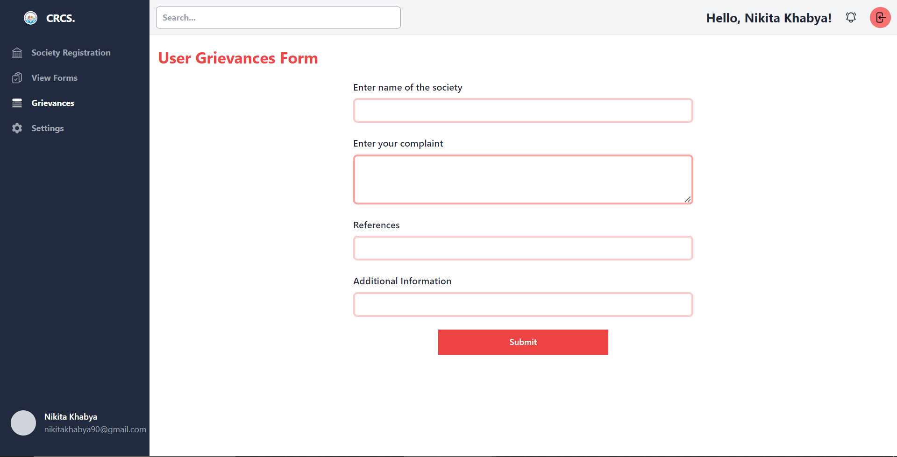

